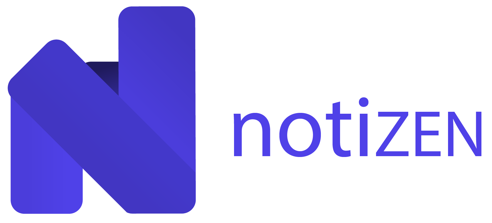

  
  <h1 align="center">Notizen frontend desktop</h1>
  

    Store and sync your notes across your devices
  

## Description
Notizen in `native` desktop version.

The vast majority of the code sit in frontend/common cause this is shared with frontend/desktop.

## Usage
99% of the time, the command to use is `npm start`.

## Scripts
* `react-start`: (CRA) Start the project in local
* `react-build`: (CRA) Build the project in local
* `react-test`: (CRA) Launch test
* `react-eject`: (CRA) Eject project
* `build`: (CRA + Electron) Launch a build of the entire application (CRA BUILD + Electron build)
* `electron-build`: (Electron) Launch an Electron build
* `release`: (Electron) Release an Electron build into Github
  You first need to write `private/GH_TOKEN.txt` file with `GH_TOKEN={GH_TOKEN}`
* `start`: (Electron) Start the project in local within Electron 

## Generate the app icon :
 `!!TODO!!`   
 You should build manually at the moment :
 * 1. run `yarn react-build`
 * 2. Drop icons into build folder.  
      With the exact names : icon.icon, icon.png and icon.icns.
 * 3. run `yarn electron-build`

---

Follow these steps before the build :
 * 1. Go to https://cloudconvert.com/svg-converter
     png => icns https://anyconv.com/fr/convertisseur-de-png-en-icns/
 * 2. Use `icon`, `png` and `icns` format
 * 3. Need to be placed in the buildResources directory (defaults to build).   
 Use the name icon.icon, icon.png and icon.icns.